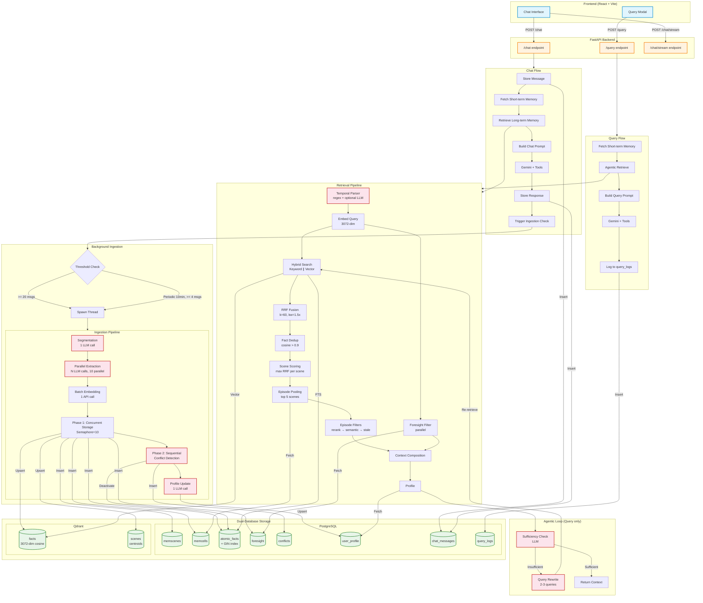
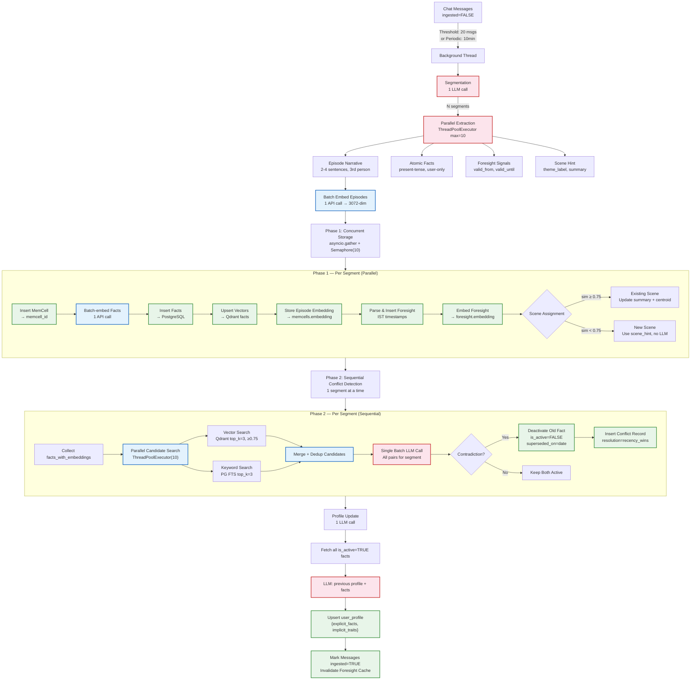
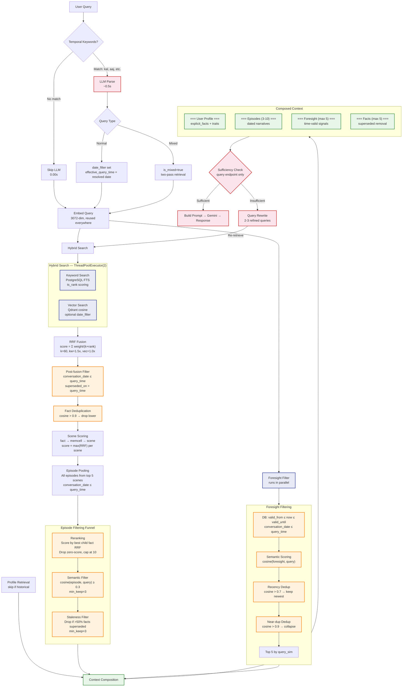
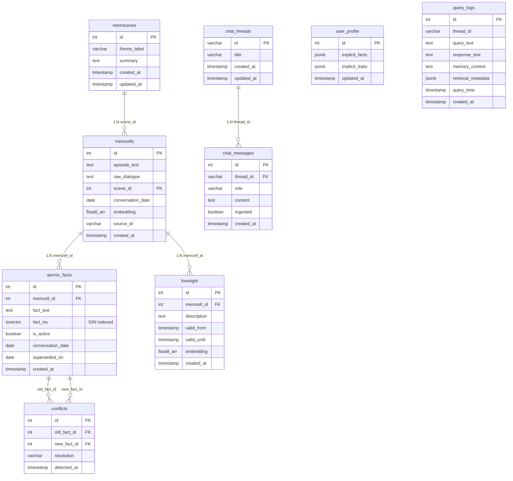
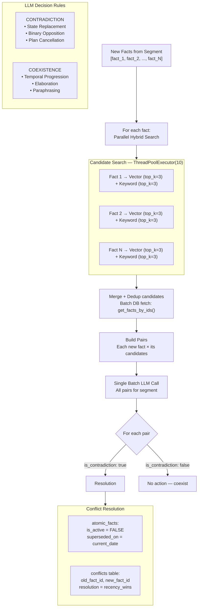
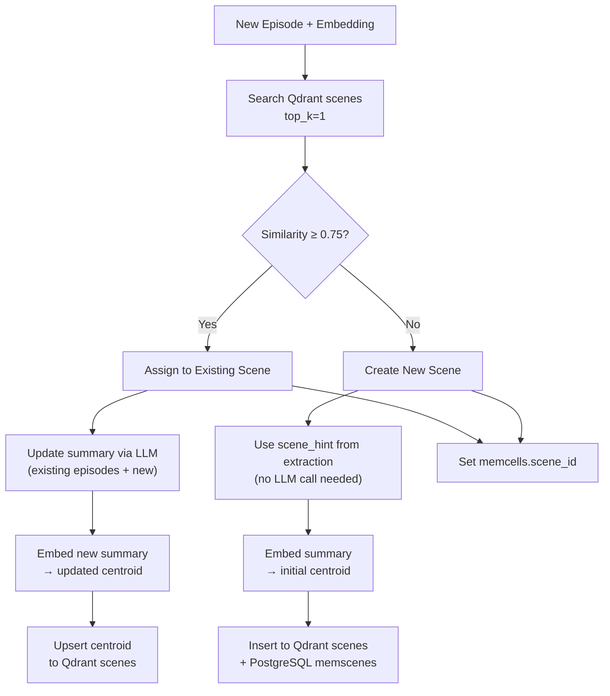
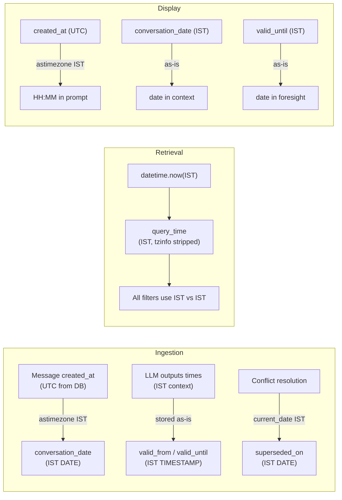

# System Design — Mermaid Diagrams

## 1. Complete System Architecture

## 2. Ingestion Pipeline Detail

## 3. Retrieval Pipeline Detail

## 4. Data Model

## 5. Conflict Detection Flow

## 6. Scene Clustering

## 7. Timezone Flow

